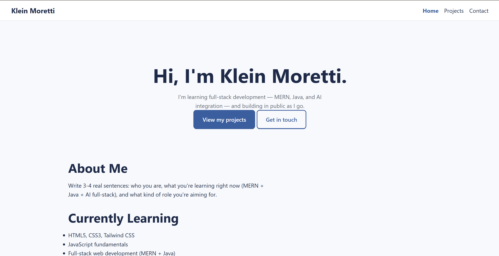

# Personal Site

My personal portfolio site — a multi-page, responsive, accessible static site built with semantic HTML5 and pure CSS3, as part of learning full-stack development (MERN + Java + AI integration).

## Live Demo
https://prashant-bansal.github.io/personal-site/

## Screenshot


## Tech Stack
- HTML5 — semantic structure, forms, accessibility (landmarks, labels, alt text, aria-current)
- CSS3 — box model, Flexbox, Grid, CSS variables, mobile-first media queries, fluid typography with clamp()
- No frameworks yet — Tailwind CSS lands in Week 3

## Features
- Responsive layout tested at 375px / 768px / 1440px (mobile, tablet, desktop)
- Sticky, flex-based navigation with a keyboard-accessible focus state
- CSS Grid photo gallery that reflows column count with zero media queries (auto-fit + minmax)
- Contact form with fully labelled inputs
- Skills table with a horizontal-scroll fallback on narrow screens

## Pages
- `index.html` — home / hero / about / skills
- `projects.html` — project cards + photo gallery
- `contact.html` — contact form

## Running Locally
```bash
git clone https://github.com/prashant-bansal/personal-site.git
cd personal-site
```
Then just open `index.html` in a browser — no build step, no dependencies.

## What I Learned / Challenges
Built this across Week 1 (Git, semantic HTML, accessibility) and Week 2 (box model, Flexbox, Grid, responsive units, mobile-first media queries) of a structured full-stack learning plan. The trickiest part was internalizing mobile-first: writing base styles for the smallest screen first and layering up with `min-width` queries, instead of the more intuitive-feeling "design desktop first, then patch it for mobile."
